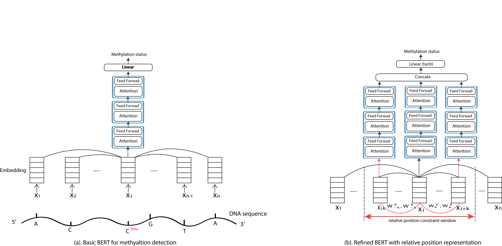

# BERT model for nanopore methylation detection




## Docker enviroment
We provide a docker image for running this code
```
docker pull yaozhong/ont_methylation:0.6
```
* ubuntu 14.04.4
* Python 3.5.2
* Pytorch 1.5.1+cu101
```
nvidia-docker run -it --shm-size=64G -v LOCAL_DATA_PATH:MOUNT_DATA_PATH yaozhong/ont_methylation:0.6
```

## Training

```
N_EPOCH=50
W_LEN=21
LR=1e-4

MODEL="biRNN_basic" ("BERT", "BERT_plus")

# the following variables provide the data information
DATA="stoiber_ecoli"
DATA_EXTRA="M_Hhal_gCgc"

python3 train.py --model $MODEL  --model_dir ${MODEL_PATH} --gpu cuda:0 --epoch ${N_EPOCH} \
 --dataset $DATA --dataset_extra $DATA_EXTRA --motif GCGC --m_shift 1 --w_len ${W_LEN} --lr $LR  

```

## Detection
```
N_EPOCH=50
W_LEN=21
LR=1e-4

DATA="stoiber_ecoli"
DATA_EXTRA="M_Sssl_Cg"

MODEL="BERT_plus" 
REF="data/ref/ecoli_k12.fasta"
FAST5_FOLD="data/Simpson/benchmark/dataset1/10"

time python detect.py --model $MODEL --model_dir $MODEL_PATH \
--gpu cuda:0 --dataset $DATA --dataset_extra $DATA_EXTRA  \
--fast5_fold $FAST5_FOLD --num_worker 24 \
--motif CG --m_shift 0 --evalMode test_mode --w_len 21 --ref_genome $REF --output_file $OUTPUT
```
